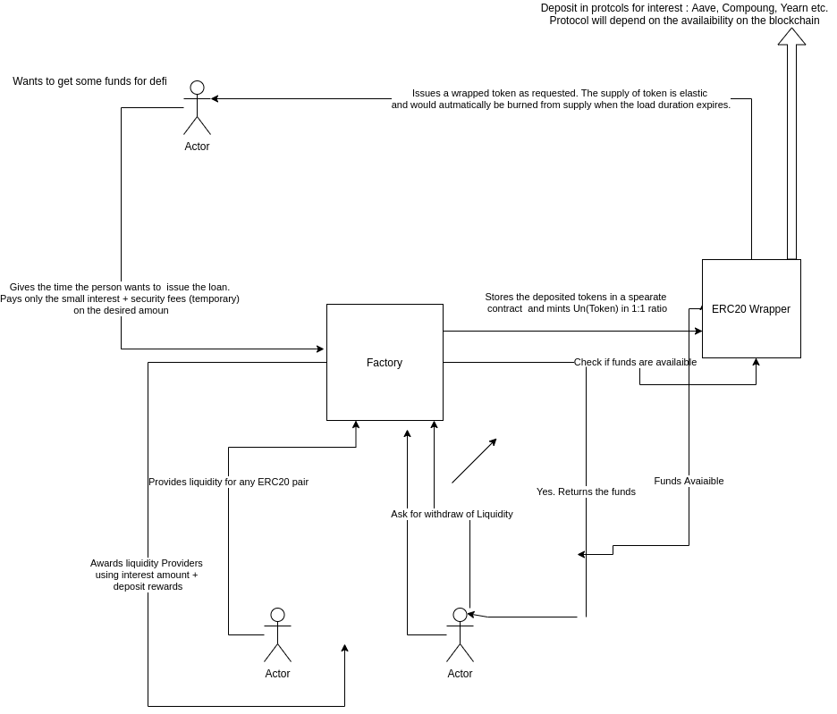

# Protocol

[Video](https://youtu.be/GhJxMFq-HFw)

## Architecture

The protocol aims to provide an underlying layer, upon which developers can build there own apps for special "Time Based" ERC20 tokens.

The protocol consists of two parties: Liquidity Providers and Borrowers

- Liquidity Provider create a "Wrapper Token" for an ERC20 of their choice.
- They add to their position by providing the givent liquidity.
- The money the deposit in the smart contract, is send out to protocols like Aave, Compound, Yearn etc., depending upon the Blockchain, to earn interest. The interest is later distributed to the liquidiity providers.
- The other party is the "Borrowers". These people come to the protocol, to take out a certains times of a given "Wrapped Token".
- To take a loan, the borrower needs to pay a small amount of fees + a security deposit. The calculation of the two is documented down below. The one rule that will be followed will be: `fees + security deposit << loan`.
- The fees paid is one time, and is distrubuted amoung the LP for more gains.
- The security money is an amount, that gets liquidated in case the borrower doesn't payback there loan on time.
- The liquidation amount is withdrawn when the loan is completely paid back.

### Tokenomics

- The "Wrapped Tokens" given out, has max supply which depends upon the underlying assets, in a 1:1 ratio.
- The Tokens are taken out on a "Time Basis", and the security fees is paid accordingly.
- The tokens being bounded by time, has few restictions:
  - The tokens cannot be send to another wallet. Only wallet -> contract interactions are permitted.
  - The token amount will be adjusted depending upon the time factor.
- The gains made as part of yield farming statergy, LP etc. will be the sole property of the Borrower and has nothing to do with the protocol or it's tokenomics.

### Interest Model

- The interest model is based on Ellipse style graphical representation.
- Rellying on such a graph makes the chances of people taking out 100% underlying liquidity goes down, since the more we approach towards the end the more interest needs to be paid. Consequently there is liquidity availaible to withdraw for LP.
- The x-axis of the graph has range 0-1 since it is the ration between `Borrowed/Total Liquidity`. Note: The Borrowed amount, during calculation is done by adding the amount requested to borrow to the equation.
- The y-axis currently is hardcode to 5 - 10 percentage. Later on would be moved to a governance model.
- The graph is formed, by shifting the Ellipse towards y-axis, such that the bottom-most point is Ymin.
- This implies the equ. formed would be:

  `x/(a^2) + ((y-Ymax)^2)/((Ymax - Ymin)^2) = 1`

  Solving we get: `y = Ymax - (sqrt( 1 - x^2 )) * (Ymax - Ymin )`

  where `x = B/T`

### Security Deposit

- Security Deposit is calculated using: `numberOfDays * Amount * SecurityRate`

Note: The math is currenlty under more research since there are some disparancy in the expected results.

The following are yet to be implemenated. These are features to be included in sprint 2 or 3. Feel free to contact me, in case you are interested on working on any of the following. Also applicable to any issues listed in the project repo.

### TODO ( Will target to finish a few of them before presenting to HackMoney Judges )

- Aave/Compound integration.
- Fix the liquidation function to point to the reserve deposited rather than the original liquidity ( currently a bug )
- Fix the interest rate model mathmetical model. Disparancy are arriving. Current implementation relies on Way based calculations, inspired by Aave.
- Building a JS SDK + Solidity Interface for developers to build there apps upon this, for expand the ecosystem vision of the project.
- Testing and deploying chainlink integration in `InterestRateStatergy` contract, to calculate equivalent Eth value for any erc20 token. Current MVP does not uses the oracle price fees, hence the numbers would work if the underlying asset is WETH.
- Fix truffle migration, working with the ui. Current deployment includes manually deployment of contracts.
- Fix the new interest related payment issues.
- More Research and Development ( points based priority for borrowers and financial advantages for eg. ).

